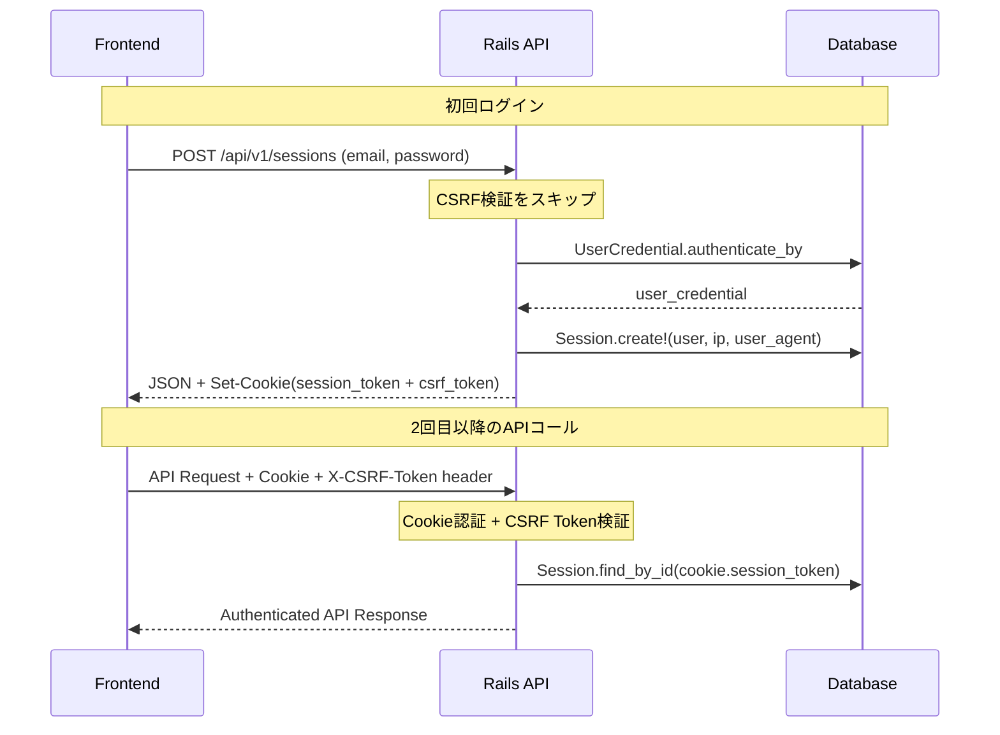

# Rails 8 認証システム実装ガイド

## 📋 概要

Rails 8標準認証ジェネレーターをベースとした、モダンなAPI認証システムの実装ガイドです。User/UserCredential分離設計とCookie + CSRF Token方式を採用し、NextJS等のSPAフロントエンドとの連携を想定しています。

## 🏗️ アーキテクチャ設計

### 設計思想

1. **責任分離**: User（アイデンティティ）とUserCredential（認証情報）の分離
2. **セキュリティファースト**: CSRF保護 + HttpOnly Cookie + SameSite制御
3. **SPA対応**: フロントエンド連携を前提としたAPI設計
4. **Rails標準準拠**: Rails 8の新機能とベストプラクティスを活用

### テーブル設計

```sql
-- ユーザーアイデンティティ（コア情報）
users
├── id (PK)
├── human_id (外部参照用UUID、unique)
├── created_at, updated_at

-- 認証情報（セキュリティ情報）
user_credentials  
├── id (PK)
├── user_id (FK) → users.id (1:1関係)
├── email_address (unique, normalized)
├── password_digest (bcrypt)
├── created_at, updated_at

-- セッション管理
sessions
├── id (PK) 
├── user_id (FK) → users.id
├── ip_address (セキュリティ監査用)
├── user_agent (セキュリティ監査用)
├── created_at, updated_at
```

### 認証フロー



## 🚀 実装手順

### Step 1: Rails 8認証ジェネレーター実行

```bash
# Rails 8標準認証システム生成
rails generate authentication

# 生成されるファイル確認
# - app/models/user.rb
# - app/models/session.rb  
# - app/models/current.rb
# - db/migrate/*_create_users.rb
# - db/migrate/*_create_sessions.rb
```

### Step 2: User/UserCredential分離

#### マイグレーション修正

```ruby
# db/migrate/*_create_users.rb
class CreateUsers < ActiveRecord::Migration[8.0]
  def change
    create_table :users do |t|
      t.string :human_id, null: false, index: { unique: true }
      t.timestamps
    end
  end
end

# db/migrate/*_create_user_credentials.rb  
class CreateUserCredentials < ActiveRecord::Migration[8.0]
  def change
    create_table :user_credentials do |t|
      t.references :user, null: false, foreign_key: true, index: { unique: true }
      t.string :email_address, null: false
      t.string :password_digest, null: false
      t.timestamps
    end
    
    add_index :user_credentials, :email_address, unique: true
  end
end
```

#### モデル実装

```ruby
# app/models/user.rb
class User < ApplicationRecord
  has_one :user_credential, dependent: :destroy
  has_many :sessions, dependent: :destroy
  
  validates :human_id, presence: true, uniqueness: true
  before_validation :generate_human_id, on: :create
  
  def authenticated?
    user_credential.present?
  end
  
  def as_json_for_api
    {
      id: id,
      human_id: human_id,
      email_address: user_credential&.email_address,
      authenticated: authenticated?
    }
  end
  
  private
  
  def generate_human_id
    return if human_id.present?
    loop do
      self.human_id = SecureRandom.hex(8)
      break unless User.exists?(human_id: human_id)
    end
  end
end

# app/models/user_credential.rb
class UserCredential < ApplicationRecord
  belongs_to :user
  has_secure_password
  
  validates :email_address, presence: true, uniqueness: true
  validates :email_address, format: { with: URI::MailTo::EMAIL_REGEXP }
  
  normalizes :email_address, with: ->(e) { e.strip.downcase }
end
```

### Step 3: ApplicationController API化

```ruby
# app/controllers/application_controller.rb
class ApplicationController < ActionController::API
  include ActionController::Cookies
  include ActionController::RequestForgeryProtection

  protect_from_forgery with: :null_session

  before_action :set_current_request_details
  before_action :authenticate

  private

  def set_current_request_details
    Current.request = request
  end

  def authenticate
    if session_record = Session.find_by_id(cookies.signed[:session_token])
      Current.session = session_record
    end
  end

  def current_user
    Current.user
  end

  def authenticated?
    current_user&.authenticated? || false
  end

  def require_authentication
    unless authenticated?
      render json: {
        success: false,
        error: "authentication_required",
        message: "ログインが必要です"
      }, status: :unauthorized
      return false
    end
    true
  end

  def start_new_session_for(user)
    user.sessions.create!(ip_address: request.remote_ip, user_agent: request.user_agent).tap do |session|
      Current.session = session
      cookies.signed.permanent[:session_token] = { value: session.id, httponly: true, same_site: :lax }
      # CSRF Token をCookieで設定
      cookies[:csrf_token] = { value: form_authenticity_token, same_site: :lax }
    end
  end

  def terminate_session
    Current.session&.destroy
    cookies.delete(:session_token)
    cookies.delete(:csrf_token)
  end
end
```

### Step 4: API Controllers実装

#### Sessions Controller

```ruby
# app/controllers/api/v1/sessions_controller.rb
class Api::V1::SessionsController < ApplicationController
  skip_before_action :authenticate, only: [ :create ]
  skip_before_action :verify_authenticity_token, only: [ :create ]
  before_action :require_authentication, only: [ :destroy ]

  def create
    email_address = params.expect(:email_address)
    password = params.expect(:password)

    if user_credential = UserCredential.authenticate_by(email_address: email_address, password: password)
      start_new_session_for user_credential.user
      @user = user_credential.user
      @user_credential = user_credential

      render :create, status: :created
    else
      @error_code = "invalid_credentials"
      @error_message = "Email address or password is incorrect"
      render :error, status: :unauthorized
    end
  end

  def destroy
    terminate_session
    render :destroy, status: :ok
  end

  def show
    @authenticated = authenticated?
    @current_user = current_user
    render :show, status: :ok
  end
end
```

#### Users Controller

```ruby
# app/controllers/api/v1/users_controller.rb
class Api::V1::UsersController < ApplicationController
  skip_before_action :authenticate, only: [ :create ]
  skip_before_action :verify_authenticity_token, only: [ :create ]

  def create
    user = User.new
    user_credential = user.build_user_credential(user_credential_params)

    if user.valid? && user_credential.valid? && user.save
      start_new_session_for user
      @user = user
      render :create, status: :created
    else
      @errors = user.errors.full_messages + user_credential.errors.full_messages
      render :error, status: :unprocessable_content
    end
  end

  def show
    unless authenticated?
      render json: {
        success: false,
        error: "authentication_required",
        message: "ログインが必要です"
      }, status: :unauthorized
      return
    end

    @current_user = current_user
    render :show
  end

  private

  def user_credential_params
    params.expect(user: [ :email_address, :password, :password_confirmation ])
  end
end
```

### Step 5: JSONレスポンステンプレート（JB）

```ruby
# app/views/api/v1/sessions/create.json.jb
{
  success: true,
  data: {
    user: @user.as_json_for_api
  }
}

# app/views/api/v1/sessions/error.json.jb
{
  success: false,
  error: @error_code,
  message: @error_message
}

# app/views/api/v1/users/create.json.jb
{
  success: true,
  data: {
    user: @user.as_json_for_api
  }
}
```

### Step 6: ルーティング設定

```ruby
# config/routes.rb
Rails.application.routes.draw do
  namespace :api do
    namespace :v1 do
      # 認証関連（複数形URL、単一リソース）
      resource :sessions, only: [ :create, :show, :destroy ]
      resource :users, only: [ :create, :show ]
    end
  end
end
```

## 🧪 テスト戦略

### RSpecベストプラクティス

#### テスト構造（Tコラ準拠）

```ruby
RSpec.describe 'Api::V1::Sessions', type: :request do
  describe 'POST /api/v1/sessions' do
    context '正しいパスワードとメールアドレスを受け取った時' do
      let!(:user) { create(:user_with_credential, email: 'test@example.com', password: 'password123') }
      let(:email_address) { 'test@example.com' }
      let(:password) { 'password123' }
      let(:expected_response) do
        {
          success: true,
          data: {
            user: {
              id: user.id,
              human_id: user.human_id,
              email_address: user.user_credential.email_address,
              authenticated: true
            }
          }
        }
      end

      it '正しいセッション情報が返ること' do
        post '/api/v1/sessions', params: { email_address: email_address, password: password }, as: :json
        
        expect(response).to have_http_status(:created)
        expect(JSON.parse(response.body, symbolize_names: true)).to eq(expected_response)
        
        # Cookie設定確認
        set_cookie_headers = response.headers['Set-Cookie']
        expect(set_cookie_headers).to include(match(/session_token=/))
        expect(set_cookie_headers).to include(match(/csrf_token=/))
      end
    end
  end
end
```

#### Committee Rails設定

```ruby
# spec/rails_helper.rb
require 'committee/rails/test_methods'

RSpec.configure do |config|
  config.include Committee::Rails::Test::Methods, type: :request
  config.include Committee::Rails::Test::Methods, type: :controller
  
  config.add_setting :committee_options
  config.committee_options = {
    schema_path: Rails.root.join('doc', 'openapi.yml').to_s,
    strict_reference_validation: true
  }
end
```

### FactoryBot設定

```ruby
# spec/factories/users.rb
FactoryBot.define do
  factory :user do
    sequence(:human_id) { |n| "user#{n}#{SecureRandom.hex(4)}" }
    
    trait :with_credential do
      after(:create) do |user|
        create(:user_credential, user: user)
      end
    end
  end
  
  factory :user_credential do
    association :user
    sequence(:email_address) { |n| "user#{n}@example.com" }
    password { "password123" }
    password_confirmation { "password123" }
  end
end
```

## 📚 API仕様書

### エンドポイント一覧

| Method | Endpoint | 説明 | 認証要否 | CSRF |
|--------|----------|------|----------|------|
| POST | `/api/v1/users` | ユーザー登録 | ❌ | Skip |
| POST | `/api/v1/sessions` | ログイン | ❌ | Skip |
| GET | `/api/v1/sessions` | セッション確認 | ❌ | ✅ |
| DELETE | `/api/v1/sessions` | ログアウト | ✅ | ✅ |
| GET | `/api/v1/users` | ユーザー情報取得 | ✅ | ✅ |

### レスポンス形式

#### 成功時

```json
{
  "success": true,
  "data": {
    "user": {
      "id": 1,
      "human_id": "abc123def456",
      "email_address": "user@example.com",
      "authenticated": true
    }
  }
}
```

#### エラー時

```json
{
  "success": false,
  "error": "invalid_credentials",
  "message": "メールアドレスまたはパスワードが正しくありません"
}
```

### Cookie仕様

```http
Set-Cookie: session_token=<signed_session_id>; Path=/; HttpOnly; SameSite=Lax; Expires=<永続化>
Set-Cookie: csrf_token=<authenticity_token>; Path=/; SameSite=Lax
```

## 🔧 使用例

### cURL実行例

```bash
# 1. ユーザー登録
curl -X POST http://localhost:3000/api/v1/users \
  -H "Content-Type: application/json" \
  -c cookies.txt \
  -d '{
    "user": {
      "email_address": "test@example.com",
      "password": "password123",
      "password_confirmation": "password123"
    }
  }'

# 2. ログイン
curl -X POST http://localhost:3000/api/v1/sessions \
  -H "Content-Type: application/json" \
  -b cookies.txt \
  -d '{
    "email_address": "test@example.com",
    "password": "password123"
  }'

# 3. 認証付きAPI呼び出し
curl -X GET http://localhost:3000/api/v1/users \
  -H "Content-Type: application/json" \
  -H "X-CSRF-Token: $(grep csrf_token cookies.txt | cut -f7)" \
  -b cookies.txt
```

### NextJS連携例

**注意**: 本プロジェクトでは専用の `apiClient` を使用してAPI通信を行います。直接 `fetch` を使用せず、以下の方法で実装してください。

```typescript
// lib/auth.ts
import { apiClient } from '@/lib/apiClient'

export async function login(email: string, password: string) {
  try {
    const result = await apiClient.post('/api/v1/sessions', {
      email_address: email,
      password: password
    });
    return result;
  } catch (error) {
    throw new Error(`ログインに失敗しました: ${error.message}`);
  }
}

export async function getUser() {
  try {
    const result = await apiClient.get('/api/v1/users');
    return result;
  } catch (error) {
    throw new Error(`ユーザー情報の取得に失敗しました: ${error.message}`);
  }
}

export async function logout() {
  try {
    const result = await apiClient.delete('/api/v1/sessions');
    return result;
  } catch (error) {
    throw new Error(`ログアウトに失敗しました: ${error.message}`);
  }
}
```

#### apiClientの特徴

- **自動認証**: セッション情報を自動的に処理
- **JWT対応**: Bearer トークン認証に対応
- **エラーハンドリング**: 統一されたエラー処理
- **TypeScript**: 型安全なAPI通信

## 🛡️ セキュリティ設定

### Cookie設定

- **HttpOnly**: XSS攻撃からのトークン保護
- **SameSite=Lax**: CSRF攻撃緩和
- **Secure**: HTTPS環境でのみ送信（本番環境）
- **Signed**: Cookie改竄防止

### CSRF保護

1. **初回ログイン**: `skip_before_action :verify_authenticity_token`
2. **認証後API**: 自動的にCSRF Token検証実行
3. **フロントエンド**: `X-CSRF-Token`ヘッダーで送信

### パスワード保護

- **bcrypt**: Rails標準の`has_secure_password`
- **正規化**: email_address自動正規化
- **バリデーション**: presence, uniqueness, format

## 🚨 トラブルシューティング

### よくある問題と解決法

#### 1. CSRF Token関連

**症状**: 401 Unauthorized（CSRF Token不一致）
```bash
# 解決法: Cookieからトークンを取得してヘッダーに設定
csrf_token=$(grep csrf_token cookies.txt | cut -f7)
curl -H "X-CSRF-Token: $csrf_token" ...
```

#### 2. Cookie送信問題

**症状**: 認証が必要なAPIで401エラー
```bash
# 解決法: -b cookies.txt オプション確認
curl -b cookies.txt http://localhost:3000/api/v1/users
```

#### 3. テスト失敗

**症状**: Set-Cookieヘッダーのテストが失敗
```ruby
# 解決法: 正規表現マッチング使用
expect(response.headers['Set-Cookie']).to include(match(/session_token=/))
```

#### 4. ルーティングエラー

**症状**: 404 Not Found
```ruby
# 解決法: resource vs resources確認
resource :sessions  # /api/v1/sessions (ID不要)
resources :sessions # /api/v1/sessions/:id (ID必要)
```

## 📊 パフォーマンス考慮事項

### セッション管理

- **メモリ効率**: Current attributes使用
- **DB負荷**: Session.find_by_id（インデックス使用）
- **スケーラビリティ**: Redis Session Store検討

### Cookie最適化

- **サイズ**: 必要最小限の情報のみ
- **有効期限**: 適切な期限設定
- **ドメイン**: 必要なサブドメインのみ

## 🔄 今後の拡張

### 推奨改善項目

1. **国際化**: I18n対応
2. **監査ログ**: セキュリティイベント記録
3. **レート制限**: ログイン試行回数制御
4. **Redis**: セッションストア移行
5. **JWT**: トークンベース認証オプション

### 機能追加例

- パスワードリセット
- 二要素認証（2FA）
- ソーシャルログイン
- API キー認証
- 管理者権限管理

---

**📅 作成日**: 2025年9月21日  
**🔄 更新日**: 2025年9月21日  
**👤 作成者**: Rails8認証システム実装チーム  
**📝 バージョン**: 1.0.0